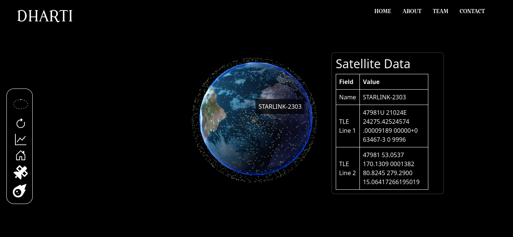
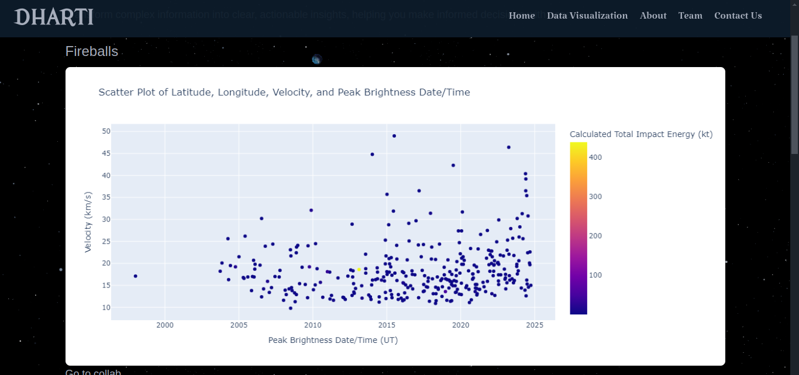
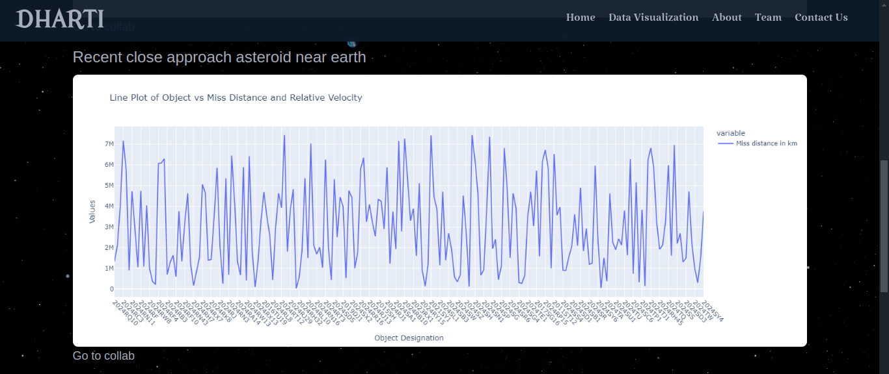
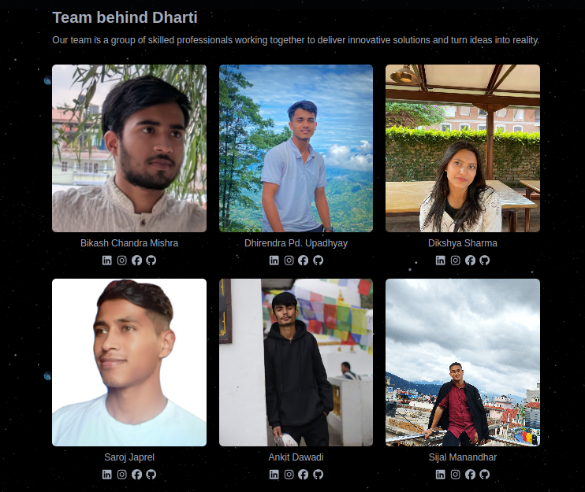
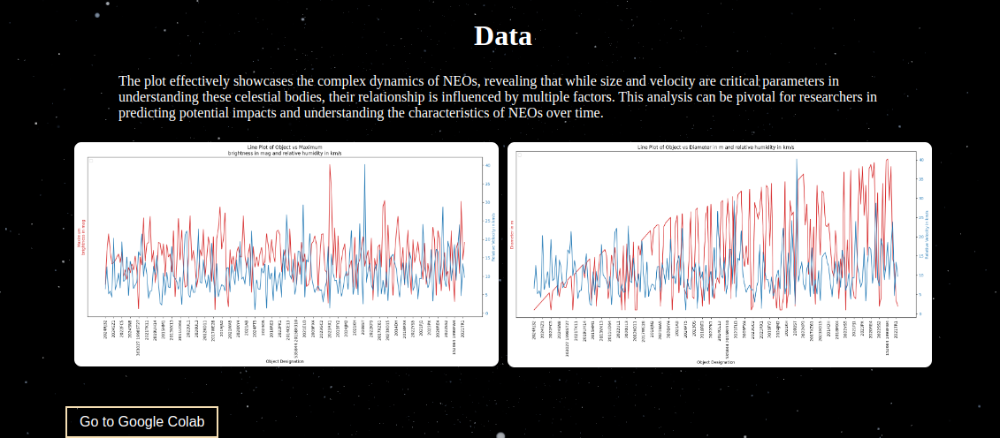

# Welcome to project Dharti-2.0



# About Project
- `` we developed a 3D model to interact with the live data of satellite hovering its live data and Data Visualization of data from Nasa  ``

# How to use the model

```
git clone https://github.com/bikashmishraa/Dharti-2.0.git
```

```
cd project_Dharti
```

```
npm run dev
```

# Visualized Data






# Our Teams



# NEO's data
_Complex Dynamic Neo's datas_

